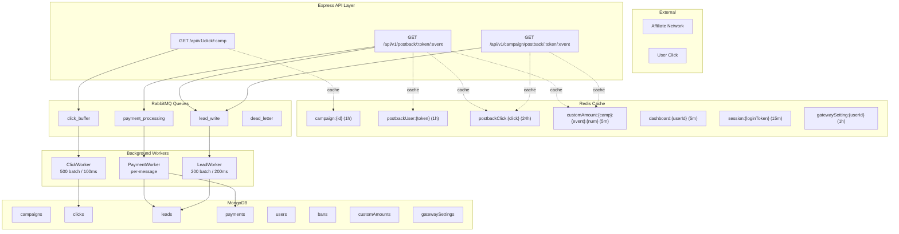
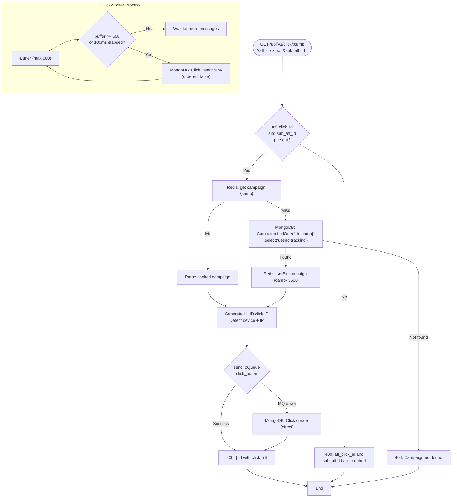
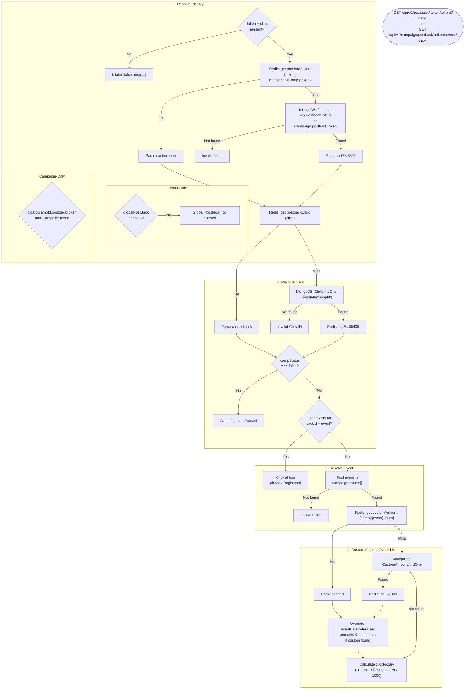
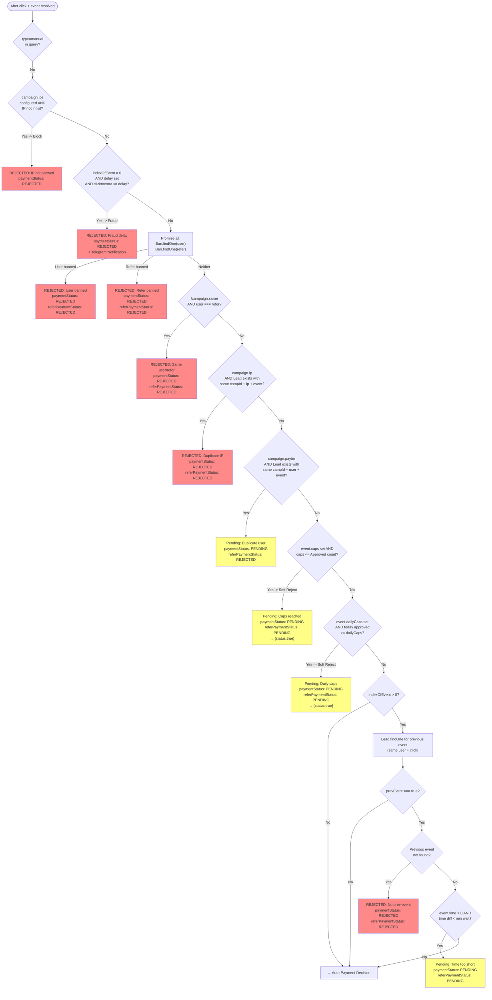
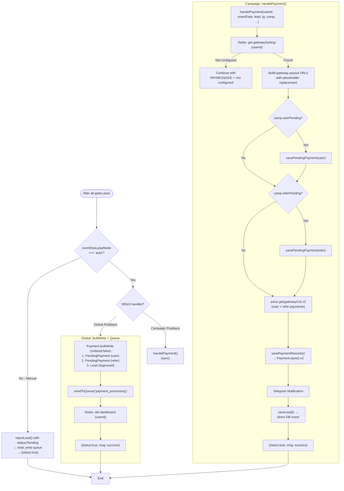
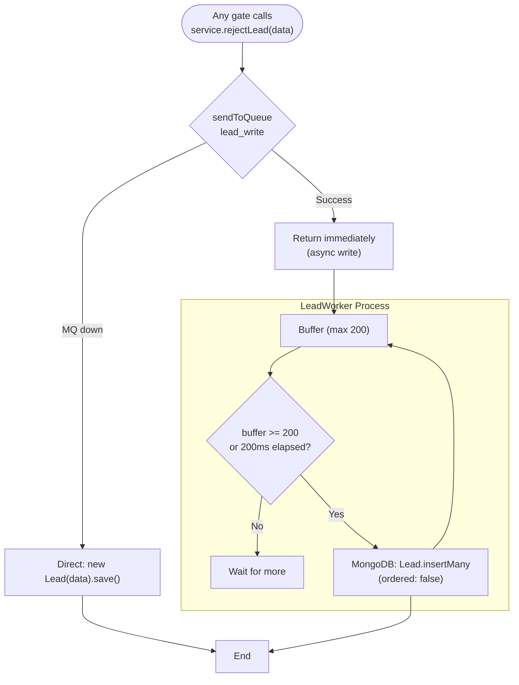
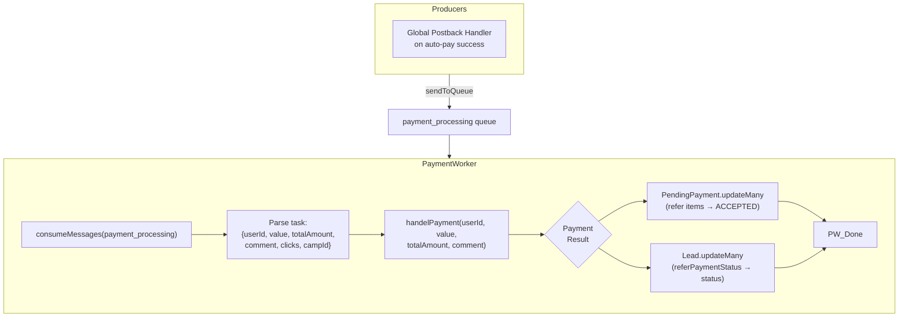

# Architecture

## System Overview



---

## Click Tracking Flow



---

## Postback Validation Chain

The validation chain is **identical** for both Global and Campaign postback handlers. The only differences are:
- **How the user is resolved**: Global uses `User.PostbackToken`, Campaign uses `Campaign.postbackToken` → `populate("userId")`
- **Auto-payment branch**: Global uses `Payment.bulkWrite(3) + sendToQueue`, Campaign uses `handelPayment()` directly



---

## Validation Gates (Sequential)

Each gate either passes or rejects with a lead recorded via `rejectLead()` → RabbitMQ `lead_write` queue.



---

## Auto-Payment Decision



---

## Reject Lead Flow

Every rejection (both REJECTED and Pending statuses) routes through `rejectLead()`:



---

## Payment Processing Flow



---

## Cache Map

| Key Pattern | TTL | Populated By | Invalidated By |
|---|---|---|---|
| `campaign:{campId}` | 1h | Tracking handler | _(expires)_ |
| `postbackUser:{PostbackToken}` | 1h | Global postback handler | `regenerateToken`, `toggleGlobal` |
| `postbackCamp:{CampaignToken}` | 1h | Campaign postback handler | _(expires)_ |
| `postbackClick:{click}` | 24h | Both postback handlers | _(never — click processed once)_ |
| `customAmount:{camp}:{event}:{num}` | 5m | Both postback handlers | _(expires)_ |
| `dashboard:{userId}` | 5m | Dashboard controller | Postback success, campaign create/delete/update |
| `session:{loginToken}` | 15m | Auth middleware | _(expires)_ |
| `gatewaySetting:{userId}` | 1h | `handelPostBackPayments` | Gateway settings update |
| `campaigns:{userId}` | 5m | Campaigns service | Campaign create/update/delete |
| `campaign:{id}` | 1h | Campaigns service | Campaign update/delete |
| `reports:{userId}:{rangeHash}` | 5m | Reports service | _(expires)_ |

---

## Queue Map

| Queue | Producer | Consumer | Batch | Purpose |
|---|---|---|---|---|
| `click_buffer` | Tracking handler | ClickWorker | 500 docs / 100ms | Buffered click insert |
| `payment_processing` | Global postback handler | PaymentWorker | 1 message | Refer payment processing |
| `lead_write` | Both postback handlers (via `rejectLead`) | LeadWorker | 200 docs / 200ms | Buffered lead insert (rejected + pending) |
| `dead_letter` | _(routed from others on failure)_ | — | — | Failed message overflow |

---

## API Route Map

All routes are registered in `middlewares/routes.js` and map to `modules/<domain>/routes.js`.

### Auth

| Method | Route | Handler | Auth |
|--------|-------|---------|------|
| POST | `/auth/login` | `modules/auth/controller.login` | No |
| POST | `/auth/register` | `modules/auth/controller.register` | No |
| POST | `/auth/forget` | `modules/auth/controller.forget` | No |
| GET | `/auth/reset/check/:token` | `modules/auth/controller.checkReset` | No |
| POST | `/auth/reset/:token` | `modules/auth/controller.resetPassword` | No |
| POST | `/logout` | `modules/auth/controller.logout` | Yes |
| POST | `/logout/:id` | `modules/auth/controller.logoutSession` | Yes |

### Campaigns

| Method | Route | Handler | Auth |
|--------|-------|---------|------|
| POST | `/add/campaign` | `modules/campaigns/controller.addCampaign` | Yes |
| GET | `/get/campaign` | `modules/campaigns/controller.getCampaign` | Yes |
| GET | `/get/campaign/:id` | `modules/campaigns/controller.getCampaignById` | Yes |
| POST | `/update/campaign` | `modules/campaigns/controller.updateCampaign` | Yes |
| POST | `/delete/campaign` | `modules/campaigns/controller.deleteCampaign` | Yes |
| GET | `/get/search` | `modules/campaigns/controller.searchCampaigns` | Yes |

### Leads

| Method | Route | Handler | Auth |
|--------|-------|---------|------|
| GET | `/get/leads/:campId` | `modules/leads/controller.getLeads` | Yes |
| GET | `/export/leads/:id` | `modules/leads/controller.exportLeads` | Yes |
| POST | `/update/leadStatus` | `modules/leads/controller.updateLeadStatus` | Yes |
| POST | `/update/selected` | `modules/leads/controller.approveSelected` | Yes |
| POST | `/leads/delete` | `modules/leads/controller.deleteLeads` | Yes |

### Clicks

| Method | Route | Handler | Auth |
|--------|-------|---------|------|
| GET | `/get/click/:id` | `modules/clicks/controller.getClicks` | Yes |
| GET | `/export/click/:id` | `modules/clicks/controller.exportClicks` | Yes |
| POST | `/get/click/search` | `modules/clicks/controller.searchClicks` | Yes |

### Payments

| Method | Route | Handler | Auth |
|--------|-------|---------|------|
| GET | `/get/payments` | `modules/payments/controller.getPayments` | Yes |
| POST | `/update/payment` | `modules/payments/controller.updatePayment` | Yes |
| POST | `/pay/user` | `modules/payments/controller.manualPay` | Yes |
| GET | `/get/pendingPayments/:id` | `modules/payments/controller.getPendingPayments` | Yes |
| POST | `/api/update/pendings/:id` | `modules/payments/controller.approvePending` | Yes |
| GET | `/api/update/pendings/:id` | `modules/payments/controller.rejectAllPending` | Yes |

### Users / Profile

| Method | Route | Handler | Auth |
|--------|-------|---------|------|
| GET | `/get/user` | `modules/users/controller.getUser` | Yes |
| GET | `/get/logins` | `modules/users/controller.getLogins` | Yes |
| GET | `/get/logins/ip` | `modules/users/controller.getMyIp` | Yes |
| POST | `/upload/user-profile` | `modules/users/controller.uploadAvatar` | Yes |

### Bans

| Method | Route | Handler | Auth |
|--------|-------|---------|------|
| GET | `/get/number` | `modules/ban/controller.getBans` | Yes |
| POST | `/ban/number` | `modules/ban/controller.banNumber` | Yes |
| POST | `/ban/unban` | `modules/ban/controller.unban` | Yes |

### Gateway Settings

| Method | Route | Handler | Auth |
|--------|-------|---------|------|
| GET | `/get/gateway-settings` | `modules/gateway-settings/controller.getSettings` | Yes |
| POST | `/update/gateway-settings` | `modules/gateway-settings/controller.updateSettings` | Yes |

### Telegram Alerts

| Method | Route | Handler | Auth |
|--------|-------|---------|------|
| GET | `/get/telegram-alert` | `modules/telegram/controller.getAlert` | Yes |
| POST | `/update/telegram-alert` | `modules/telegram/controller.updateAlert` | Yes |

### Custom Amounts

| Method | Route | Handler | Auth |
|--------|-------|---------|------|
| POST | `/api/v1/custom` | `modules/custom-amount/controller.customAmount` | Yes |
| GET | `/get/custom` | `modules/custom-amount/controller.getCustom` | Yes |
| POST | `/detete/custom` | `modules/custom-amount/controller.deleteCustom` | Yes |
| POST | `/api/v1/update/custom/:apikey` | `modules/custom-amount/controller.updateCustomExternal` | No |
| POST | `/api/v1/get/custom/:apikey` | `modules/custom-amount/controller.getCustomExternal` | No |

### Billing

| Method | Route | Handler | Auth |
|--------|-------|---------|------|
| GET | `/get/billing` | `modules/billing/controller.getBilling` | Yes |

### Dashboard

| Method | Route | Handler | Auth |
|--------|-------|---------|------|
| GET | `/get/dashboard` | `modules/dashboard/controller.getDashboard` | Yes |
| POST | `/get/dashboard` | `modules/dashboard/controller.postDashboard` | Yes |

### Reports

| Method | Route | Handler | Auth |
|--------|-------|---------|------|
| GET | `/get/reports` | `modules/reports/controller.getReports` | Yes |
| GET | `/get/new/reports/:id` | `modules/reports/controller.getNewReport` | Yes |

### Postback

| Method | Route | Handler | Auth |
|--------|-------|---------|------|
| GET | `/get/postback` | `modules/postback/controller.getConfig` | Yes |
| POST | `/edit/postback` | `modules/postback/controller.toggleGlobal` | Yes |
| POST | `/update/postback` | `modules/postback/controller.regenerateToken` | Yes |

### Postback Processing (no auth)

| Method | Route | Handler |
|--------|-------|---------|
| GET | `/api/v1/postback/:PostbackToken/:event` | `modules/postback/controller.handleGlobalPostback` |
| GET | `/api/v1/campaign/postback/:CampaignToken/:event` | `modules/postback/controller.handleCampaignPostback` |

### Tracking (no auth)

| Method | Route | Handler |
|--------|-------|---------|
| GET | `/api/v1/click/:camp` | `modules/tracking/controller.track` |

### External APIs (no auth)

| Method | Route | Handler |
|--------|-------|---------|
| GET | `/api/v1/view/camp/:apikey` | `modules/apis/controller.getCamp` |
| GET | `/api/v1/checkRefer/:token/:offerid` | `modules/apis/controller.checkRefer` |
| GET | `/api/v1/user/:token/:offerid` | `modules/apis/controller.userAPI` |
| GET | `/api/v1/checkPending/:token/:offerid` | `modules/apis/controller.checkPending` |
| GET | `/api/v1/releasePending` | `modules/apis/controller.releasePending` |

---

---

## API Migration Map (Legacy → RESTful)

All old legacy routes continue working. The new RESTful routes coexist alongside them.

### Auth

| Old URL | Old Method | New URL | New Method | Δ |
|---------|-----------|---------|-----------|-----|
| `/auth/login` | POST | `/api/v1/auth/login` | POST | none |
| `/auth/register` | POST | `/api/v1/auth/register` | POST | none |
| `/auth/forget` | POST | `/api/v1/auth/forgot-password` | POST | none |
| `/auth/reset/check/:token` | GET | `/api/v1/auth/reset-token/:token` | GET | none |
| `/auth/reset/:token` | POST | `/api/v1/auth/reset-password/:token` | POST | none |
| `/logout` | ALL | `/api/v1/auth/logout` | POST | ALL→POST |
| `/logout/:id` | ALL | `/api/v1/auth/logout/:sessionId` | POST | ALL→POST |

### Tracking

| Old URL | Old Method | New URL | New Method | Δ |
|---------|-----------|---------|-----------|-----|
| `/api/v1/click/:camp` | GET | `/api/v1/tracking/:campId` | GET | none |

### Postback

| Old URL | Old Method | New URL | New Method | Δ |
|---------|-----------|---------|-----------|-----|
| `/api/v1/postback/:PostbackToken/:event` | GET | `/api/v1/postback/:token/:event` | GET | none |
| `/api/v1/campaign/postback/:CampaignToken/:event` | GET | `/api/v1/campaigns/:campaignId/postback/:event` | GET | restructured |
| `/get/postback` | GET | `/api/v1/postback/config` | GET | none |
| `/edit/postback` | POST | `PATCH /api/v1/postback/config` | PATCH | POST→PATCH |
| `/update/postback` | POST | `POST /api/v1/postback/config/regenerate-token` | POST | none |

### Campaigns

| Old URL | Old Method | New URL | New Method | Δ |
|---------|-----------|---------|-----------|-----|
| `/add/campaign` | POST | `POST /api/v1/campaigns` | POST | none |
| `/get/campaign` | GET | `GET /api/v1/campaigns` | GET | none |
| `/get/campaign/:id` | GET | `GET /api/v1/campaigns/:id` | GET | none |
| `/update/campaign` | POST | `PATCH /api/v1/campaigns/:id` | PATCH | POST→PATCH |
| `/delete/campaign` | POST | `DELETE /api/v1/campaigns/:id` | DELETE | POST→DELETE |

### Leads

| Old URL | Old Method | New URL | New Method | Δ |
|---------|-----------|---------|-----------|-----|
| `/get/leads/:campId` | GET | `GET /api/v1/campaigns/:campId/leads` | GET | none |
| `/export/leads/:id` | GET | `GET /api/v1/campaigns/:campId/leads/export` | GET | none |
| `/update/leadStatus` | POST | `PATCH /api/v1/leads/:id/status` | PATCH | POST→PATCH |
| `/update/selected` | POST | `POST /api/v1/leads/:id/approve` | POST | none |
| `/leads/delete` | POST | `POST /api/v1/leads/batch-delete` | POST | none |

### Clicks

| Old URL | Old Method | New URL | New Method | Δ |
|---------|-----------|---------|-----------|-----|
| `/get/click/:id` | GET | `GET /api/v1/clicks/:id` | GET | none |
| `/export/click/:id` | GET | `GET /api/v1/clicks/:id/export` | GET | none |
| `/get/click/search` | POST | `POST /api/v1/clicks/search` | POST | none |

### Payments

| Old URL | Old Method | New URL | New Method | Δ |
|---------|-----------|---------|-----------|-----|
| `/get/payments` | GET | `GET /api/v1/payments` | GET | none |
| `/update/payment` | POST | `POST /api/v1/leads/:leadId/process-payment` | POST | none |
| `/pay/user` | POST | `POST /api/v1/payments/manual` | POST | none |
| `/get/pendingPayments/:id` | GET | `GET /api/v1/payments/pending?campaignId=:id` | GET | id→query |
| `/api/update/pendings/:id` | POST | `POST /api/v1/payments/pending/:campaignId/approve` | POST | none |
| `/api/update/pendings/:id` | GET | `POST /api/v1/payments/pending/:campaignId/reject-all` | POST | GET→POST |

### Dashboard

| Old URL | Old Method | New URL | New Method | Δ |
|---------|-----------|---------|-----------|-----|
| `/get/dashboard` | GET | `GET /api/v1/dashboard` | GET | none |
| `/get/dashboard` | POST | `POST /api/v1/dashboard/range` | POST | none |

### Reports

| Old URL | Old Method | New URL | New Method | Δ |
|---------|-----------|---------|-----------|-----|
| `/get/reports` | GET | `GET /api/v1/reports` | GET | none |
| `/get/new/reports/:id` | GET | `GET /api/v1/campaigns/:id/report` | GET | none |

### Bans

| Old URL | Old Method | New URL | New Method | Δ |
|---------|-----------|---------|-----------|-----|
| `/get/number` | GET | `GET /api/v1/bans` | GET | none |
| `/ban/number` | POST | `POST /api/v1/bans` | POST | none |
| `/ban/unban` | POST | `DELETE /api/v1/bans/:id` | DELETE | POST→DELETE |

### Gateway Settings

| Old URL | Old Method | New URL | New Method | Δ |
|---------|-----------|---------|-----------|-----|
| `/get/gateway-settings` | GET | `GET /api/v1/gateway-settings` | GET | none |
| `/update/gateway-settings` | POST | `PUT /api/v1/gateway-settings` | PUT | POST→PUT |

### Telegram

| Old URL | Old Method | New URL | New Method | Δ |
|---------|-----------|---------|-----------|-----|
| `/get/telegram-alert` | GET | `GET /api/v1/users/me/telegram-alert` | GET | none |
| `/update/telegram-alert` | POST | `PUT /api/v1/users/me/telegram-alert` | PUT | POST→PUT |

### Custom Amounts

| Old URL | Old Method | New URL | New Method | Δ |
|---------|-----------|---------|-----------|-----|
| `POST /api/v1/custom` | POST | `POST /api/v1/custom-amounts` | POST | none |
| `/get/custom` | GET | `GET /api/v1/custom-amounts` | GET | none |
| `/detete/custom` | POST | `DELETE /api/v1/custom-amounts/:id` | DELETE | POST→DELETE |
| `POST /api/v1/update/custom/:apikey` | POST | `POST /api/v1/external/custom-amount/:apiKey` | POST | none |
| `POST /api/v1/get/custom/:apikey` | POST | `GET /api/v1/external/custom-amount/:apiKey` | GET | POST→GET |

### External APIs

| Old URL | Old Method | New URL | New Method | Δ |
|---------|-----------|---------|-----------|-----|
| `GET /api/v1/checkRefer/:token/:offerid` | GET | `GET /api/v1/external/refer-leads/:token/:offerId` | GET | none |
| `GET /api/v1/user/:token/:offerid` | GET | `GET /api/v1/external/user-leads/:token/:offerId` | GET | none |
| `GET /api/v1/checkPending/:token/:offerid` | GET | `GET /api/v1/external/pending-payments/:token/:offerId` | GET | none |
| `POST /api/v1/releasePending/:token/:offerid` | POST | `POST /api/v1/external/release-pending/:token/:offerId` | POST | none |
| `GET /api/v1/view/camp/:apikey` | GET | `GET /api/v1/external/campaign/:apiKey` | GET | none |

### Users / Profile

| Old URL | Old Method | New URL | New Method | Δ |
|---------|-----------|---------|-----------|-----|
| `/get/user` | GET | `GET /api/v1/users/me` | GET | none |
| `/get/logins` | GET | `GET /api/v1/users/me/sessions` | GET | none |
| `/get/logins/ip` | GET | `GET /api/v1/utils/my-ip` | GET | none |
| `/upload/user-profile` | POST | `POST /api/v1/users/me/avatar` | POST | none |

### Billing

| Old URL | Old Method | New URL | New Method | Δ |
|---------|-----------|---------|-----------|-----|
| `/get/billing` | GET | `GET /api/v1/billing` | GET | none |

---

## Module Structure

Each domain module lives under `modules/<domain>/` and owns its full stack:

```
modules/
├── apis/             controller.js, routes.js
├── auth/             model.js, service.js, controller.js, routes.js
├── ban/              model.js, service.js, controller.js, routes.js
├── billing/          model.js, service.js, controller.js, routes.js
├── campaigns/        model.js, service.js, controller.js, routes.js
├── clicks/           model.js, service.js, controller.js, routes.js
├── custom-amount/    model.js, service.js, controller.js, routes.js
├── dashboard/        controller.js, routes.js
├── gateway-settings/ model.js, service.js, controller.js, routes.js
├── leads/            model.js, service.js, controller.js, routes.js
├── payments/         model.js, service.js, controller.js, routes.js
├── postback/         service.js, controller.js, routes.js
├── reports/          service.js, controller.js, routes.js
├── telegram/         service.js, controller.js, routes.js
├── tracking/         service.js, controller.js, routes.js
└── users/            model.js, service.js, controller.js, routes.js
```
