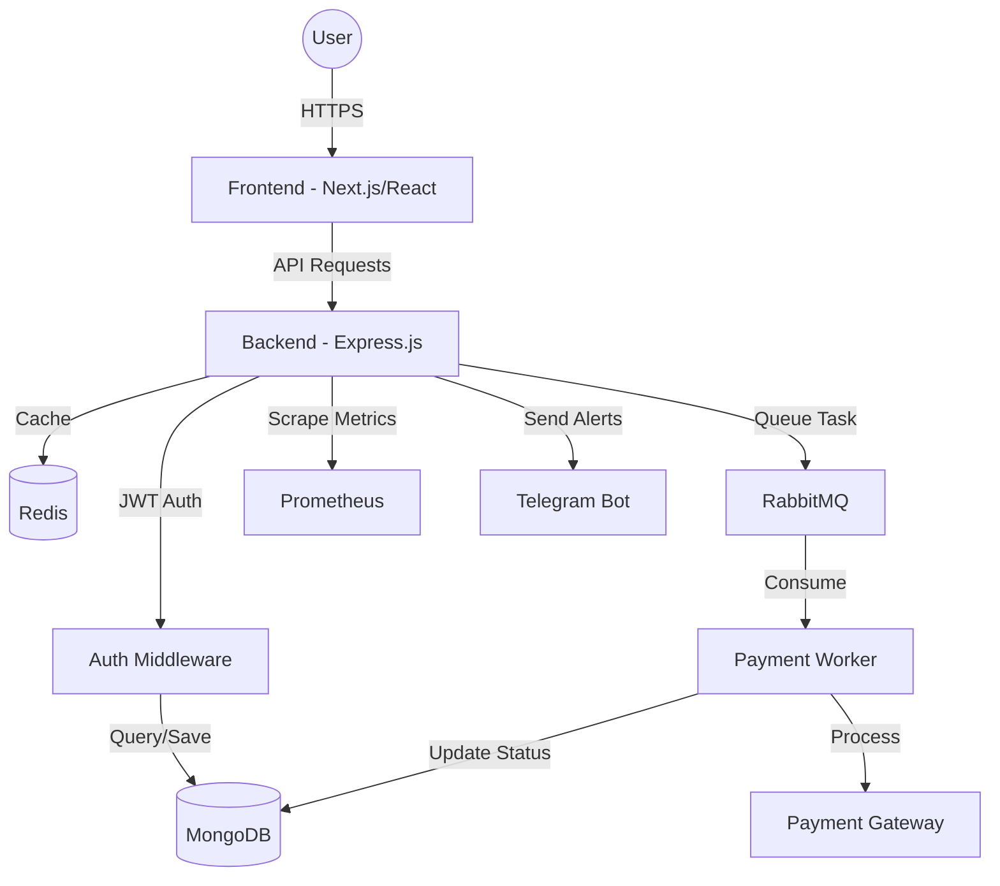

# Affiliate Panel (Instant Panel) - Project Documentation

## Project Overview
This is a full-stack affiliate management panel designed for tracking campaigns, managing leads, and processing payments. It leverages a modern JavaScript stack with a custom Next.js and Express integration.

### Core Technologies
- **Frontend:** [Next.js](https://nextjs.org/) (v13.3.0, Pages Router), [Tailwind CSS](https://tailwindcss.com/), [Material UI (MUI)](https://mui.com/), [NextUI](https://nextui.org/).
- **Backend:** [Express.js](https://expressjs.com/) (Custom Server), [Node.js](https://nodejs.org/).
- **Database:** [MongoDB](https://www.mongodb.com/) (via [Mongoose](https://mongoosejs.com/)).
- **Messaging/Task Queue:** [RabbitMQ](https://www.rabbitmq.com/) (used for asynchronous payment processing).
- **Caching/Storage:** [Redis](https://redis.io/).
- **Monitoring:** [Prometheus](https://prometheus.io/) (via `prom-client` and `prometheus.yml`).
- **DevOps:** [Docker](https://www.docker.com/) and [Docker Compose](https://docs.docker.com/compose/).
- **Integrations:** [Telegraf](https://telegraf.js.org/) (Telegram Bot) for alerts.

## Architecture
- **Next.js Integration:** The project uses a custom Express server (`server/index.js`) to handle both the Next.js frontend and various API/Auth routes.
- **Asynchronous Processing:** A dedicated worker (`server/worker/paymentWorker.js`) consumes tasks from RabbitMQ to handle payments and update lead statuses without blocking the main thread.
- **Monitoring:** Prometheus metrics are exposed at `/metrics` (with optional token-based authentication).

## System Architecture

### Components
1. **Frontend (Next.js/React):** User interface for affiliates and administrators, providing campaign management, lead tracking, and payment requests.
2. **Web Server (Express.js):** Custom backend server that serves the Next.js application and handles REST API requests.
3. **API Layer:** Provides endpoints for authentication, data retrieval, and business logic.
4. **Authentication (JWT):** Secure access control using JSON Web Tokens stored in cookies or headers.
5. **Database (MongoDB):** Persistent storage for all application data (Users, Campaigns, Clicks, Leads, Payments).
6. **Cache (Redis):** High-performance caching for session data and frequent lookups.
7. **Task Queue (RabbitMQ):** Asynchronous message broker used to offload long-running tasks like payment processing.
8. **Payment Worker (Node.js):** Background process that consumes tasks from RabbitMQ to process payments and update database states.
9. **Monitoring (Prometheus):** Service for collecting and aggregating performance metrics.
10. **External Integrations:** Telegram Bot for real-time notifications and payment gateways for transaction processing.

### Component Interactions


### Full System Design
The system is built as a semi-decoupled full-stack application. The **Express server** acts as the central hub, integrating with **Next.js** for SSR/Frontend and providing a RESTful API. 

Authentication is handled via **JWT**, ensuring stateless scalability. Data is persisted in **MongoDB**, while **Redis** provides low-latency data access for performance-critical paths. 

To ensure the web server remains responsive, heavy operations (specifically payment processing) are offloaded to a **RabbitMQ** queue. A dedicated **Payment Worker** listens to this queue, interacting with external APIs and updating the database asynchronously. This decoupled architecture allows the worker to scale independently and ensures that payment processing does not impact user experience.

Monitoring is integrated directly into the Express pipeline using **Prometheus**, exposing a `/metrics` endpoint for telemetry. Alerts and notifications are pushed via **Telegraf** to Telegram, providing real-time operational awareness.

## Building and Running

### Prerequisites
- Docker and Docker Compose
- Node.js (v18 recommended)

### Development
1. **Full Stack (Docker):**
   ```bash
   docker-compose up --build
   ```
   This starts the application, MongoDB, Redis, RabbitMQ, and Prometheus.

2. **Local Development (No Docker):**
   - Ensure MongoDB, Redis, and RabbitMQ are running locally.
   - Create a `.env` file based on the environment variables needed (see `server/index.js`).
   - Run the server with nodemon:
     ```bash
     npm run all
     ```
   - Run Next.js only:
     ```bash
     npm run dev
     ```

### Production
```bash
npm run build
npm run start
```

## Directory Structure
- `pages/`: Next.js frontend pages and built-in API routes.
- `server/`: Custom Express backend.
    - `models/`: Mongoose schemas (User, Campaign, Click, Lead, etc.).
    - `routes/`: Express route handlers for API and Auth.
    - `middlewares/`: Authentication and routing middlewares.
    - `worker/`: Background workers (e.g., RabbitMQ consumers).
    - `lib/`: Utility functions and core logic (e.g., payment handling, notification logic).
- `components/`: Reusable React components.
- `public/`: Static assets (images, CSS, JS templates).
- `styles/`: Global and component-specific CSS.

## Key Files
- `server/index.js`: Entry point for the custom Express server.
- `package.json`: Project dependencies and scripts.
- `docker-compose.yaml`: Infrastructure orchestration.
- `prometheus.yml`: Monitoring configuration.
- `server/middlewares/routes.js`: Centralized Express route definitions.

## Development Conventions
- **Routing:** Prefer adding new API routes to `server/routes/` and registering them in `server/middlewares/routes.js`.
- **Authentication:** Use `authValid` and `authValidWithDb` middlewares from `server/middlewares/auth.js` for protected routes.
- **Styling:** The project uses a mix of Tailwind CSS and specialized UI libraries (MUI, NextUI). Adhere to existing component patterns.
- **Async Tasks:** For long-running or critical operations (like payments), use the RabbitMQ task queue logic found in `server/lib/rabbitMQ.js` and `server/worker/`.
