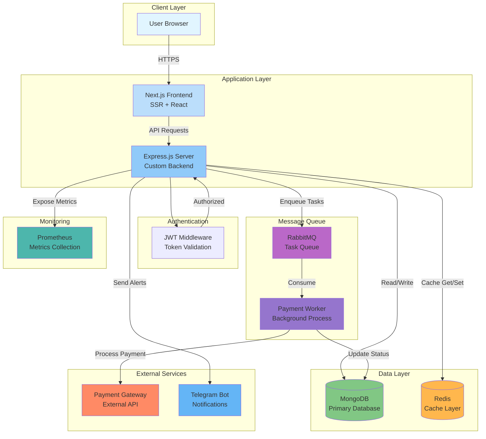
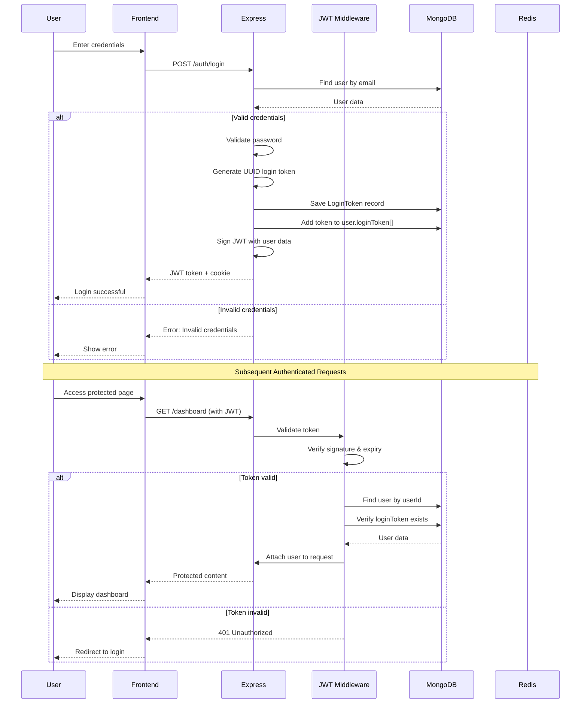
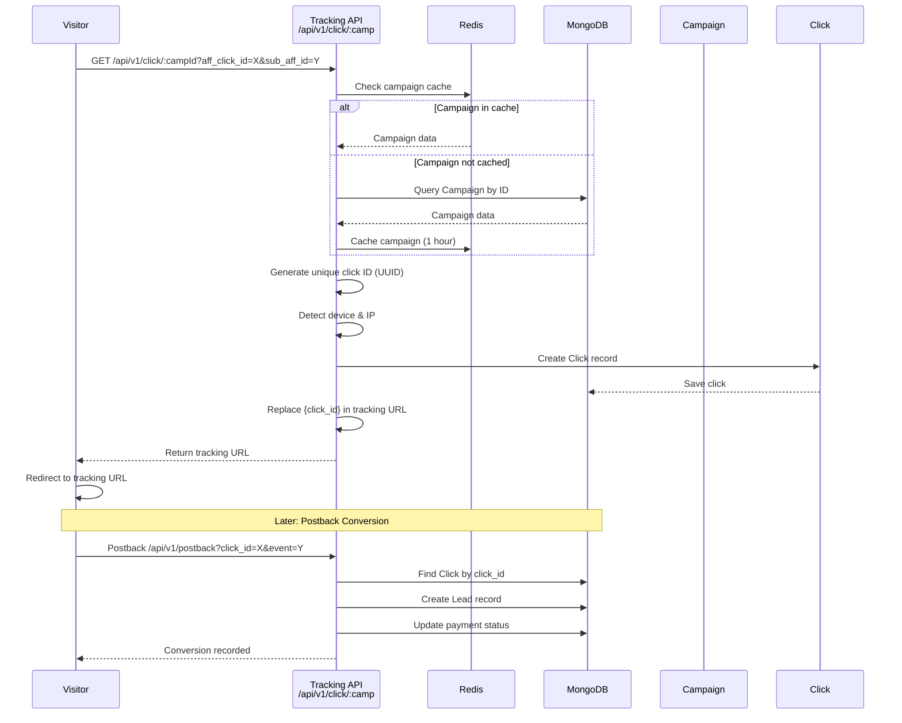
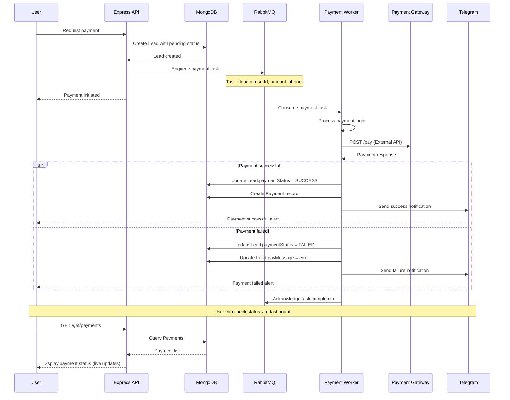
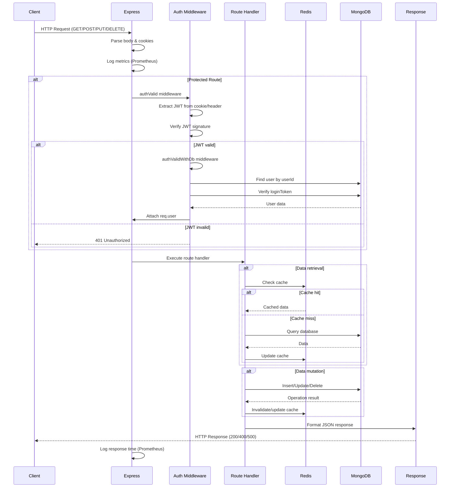
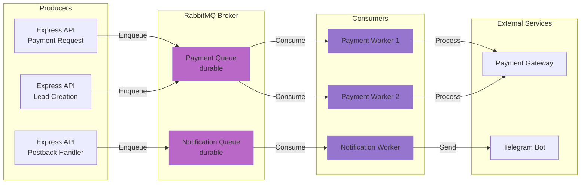

# Affiliate Panel (Instant Panel) - Project Documentation

## Project Overview
This is a full-stack affiliate management panel designed for tracking campaigns, managing leads, and processing payments. It leverages a modern JavaScript stack with a custom Next.js and Express integration.

### Core Technologies
- **Frontend:** [Next.js](https://nextjs.org/) (v13.3.0, Pages Router), [Tailwind CSS](https://tailwindcss.com/), [Material UI (MUI)](https://mui.com/), [NextUI](https://nextui.org/)
- **Backend:** [Express.js](https://expressjs.com/) (Custom Server), [Node.js](https://nodejs.org/)
- **Database:** [MongoDB](https://www.mongodb.com/) (via [Mongoose](https://mongoosejs.com/))
- **Messaging/Task Queue:** [RabbitMQ](https://www.rabbitmq.com/) (used for asynchronous payment processing)
- **Caching/Storage:** [Redis](https://redis.io/)
- **Monitoring:** [Prometheus](https://prometheus.io/) (via `prom-client` and `prometheus.yml`)
- **DevOps:** [Docker](https://www.docker.com/) and [Docker Compose](https://docs.docker.com/compose/)
- **Integrations:** [Telegraf](https://telegraf.js.org/) (Telegram Bot) for alerts

---

## System Architecture

### High-Level Architecture



### Component Interactions

The system is built as a semi-decoupled full-stack application:

1. **Frontend (Next.js/React):** User interface for affiliates and administrators, providing campaign management, lead tracking, and payment requests
2. **Web Server (Express.js):** Custom backend server that serves the Next.js application and handles REST API requests
3. **API Layer:** Provides endpoints for authentication, data retrieval, and business logic
4. **Authentication (JWT):** Secure access control using JSON Web Tokens stored in cookies or headers
5. **Database (MongoDB):** Persistent storage for all application data (Users, Campaigns, Clicks, Leads, Payments)
6. **Cache (Redis):** High-performance caching for session data and frequent lookups
7. **Task Queue (RabbitMQ):** Asynchronous message broker used to offload long-running tasks like payment processing
8. **Payment Worker (Node.js):** Background process that consumes tasks from RabbitMQ to process payments and update database states
9. **Monitoring (Prometheus):** Service for collecting and aggregating performance metrics
10. **External Integrations:** Telegram Bot for real-time notifications and payment gateways for transaction processing

---

## Database Schema

```mermaid
erDiagram
    Users ||--o{ Campaigns : creates
    Users ||--o{ Clicks : owns
    Users ||--o{ Leads : owns
    Users ||--o{ Payments : receives
    Users ||--o{ LoginToken : has
    
    Campaigns ||--o{ Clicks : tracks
    Campaigns ||--o{ Leads : generates
    Campaigns ||--o{ Payments : triggers
    
    Clicks ||--|| Leads : converts_to
    Clicks ||--o{ Payments : initiates
    
    Leads ||--o{ Payments : results_in
    
    Users {
        ObjectId _id PK
        string name
        string userName UK
        string userId UK
        string PostbackToken UK
        string email UK
        array loginToken
        number phone
        string profileImg
        object tgId
        string password
        boolean premium
        string plan
        string userType
        string userStatus
        date premiumExpireDate
        date createdAt
        date updatedAt
    }
    
    Campaigns {
        ObjectId _id PK
        ObjectId userId FK
        string user
        string name
        number offerID
        boolean campStatus
        boolean paytm
        boolean ip
        boolean same
        boolean crDelay
        string delay
        boolean prevEvent
        boolean userPending
        boolean referPending
        string tracking
        object uniqueOfferID UK
        array ips
        array events
        date createdAt
    }
    
    Clicks {
        ObjectId _id PK
        ObjectId userId FK
        ObjectId campId FK
        string click UK
        string user
        string refer
        string number
        string ip
        object device
        object params
        date createdAt
    }
    
    Leads {
        ObjectId _id PK
        ObjectId userId FK
        ObjectId campId FK
        ObjectId clickId FK
        string click
        string user
        number userAmount
        number referAmount
        string refer
        string ip
        string event
        string status
        string paymentStatus
        string payMessage
        string referPaymentStatus
        string referPayMessage
        string message
        object params
        string clicktoconv
        object uniqueClick UK
        date createdAt
    }
    
    Payments {
        ObjectId _id PK
        ObjectId userId FK
        ObjectId campId FK
        ObjectId clickId FK
        string number
        number amount
        string comment
        string type
        mixed response
        string for
        string event
        string payUrl
        date createdAt
    }
    
    LoginToken {
        ObjectId _id PK
        ObjectId userId FK
        string token
        string ip
        object device
        date createdAt
    }
```



---

## Authentication Flow



---

## Click Tracking & Lead Conversion Flow



---

## Payment Processing Flow (Live Updates via RabbitMQ)



---

## API Request/Response Flow



---

## Real-Time Features & Live Updates

### RabbitMQ Message Queue Architecture



### Live Update Mechanisms

1. **RabbitMQ Task Queue:** Asynchronous processing of payments and notifications
2. **Redis Caching:** Real-time data access with automatic cache invalidation
3. **Telegram Notifications:** Instant alerts for payment status changes
4. **Prometheus Metrics:** Live monitoring of system performance and request metrics

---

## Building and Running

### Prerequisites
- Docker and Docker Compose
- Node.js (v18 recommended)

### Development

#### Full Stack (Docker)
```bash
docker-compose up --build
```
This starts the application, MongoDB, Redis, RabbitMQ, and Prometheus.

#### Local Development (No Docker)
1. Ensure MongoDB, Redis, and RabbitMQ are running locally
2. Create a `.env` file based on the environment variables needed:
   ```env
   DB_URL=mongodb://localhost:27017/affiliate-panel
   PORT=3000
   RABBITMQ_URL=amqp://localhost
   METRICS_AUTH_TOKEN=your-secret-token
   ```
3. Run the server with nodemon:
   ```bash
   npm run all
   ```
4. Run Next.js only:
   ```bash
   npm run dev
   ```

### Production
```bash
npm run build
npm run start
```

---

## Directory Structure

```
instant-panel/
├── pages/                    # Next.js frontend pages
│   ├── _app.js              # App wrapper
│   ├── _document.js         # Document wrapper
│   ├── dashboard/           # Protected dashboard pages
│   └── auth/                # Authentication pages
├── server/                   # Custom Express backend
│   ├── index.js             # Entry point
│   ├── models/              # Mongoose schemas
│   │   ├── Users.js
│   │   ├── Campaigns.js
│   │   ├── Clicks.js
│   │   ├── Leads.js
│   │   ├── Payments.js
│   │   └── ...
│   ├── routes/              # Express route handlers
│   │   ├── auth/            # Authentication routes
│   │   ├── api/             # API routes
│   │   │   ├── campaign/
│   │   │   ├── leads/
│   │   │   ├── payments/
│   │   │   ├── tracking/
│   │   │   └── ...
│   │   └── logout.js
│   ├── middlewares/         # Express middlewares
│   │   ├── auth.js          # JWT authentication
│   │   └── routes.js        # Route registration
│   ├── worker/              # Background workers
│   │   └── paymentWorker.js
│   └── lib/                 # Utility functions
│       ├── rabbitMQ.js      # RabbitMQ client
│       ├── redisClient.js   # Redis client
│       ├── logger.js
│       └── ...
├── components/              # Reusable React components
├── public/                  # Static assets
├── styles/                  # Global CSS
├── docker-compose.yaml      # Infrastructure orchestration
├── prometheus.yml           # Monitoring configuration
└── package.json             # Dependencies and scripts
```

---

## Key Files

- [server/index.js](file:///Users/gauravchaudhary/Projects/Node/instant-panel/server/index.js) - Entry point for the custom Express server
- [package.json](file:///Users/gauravchaudhary/Projects/Node/instant-panel/package.json) - Project dependencies and scripts
- [docker-compose.yaml](file:///Users/gauravchaudhary/Projects/Node/instant-panel/docker-compose.yaml) - Infrastructure orchestration
- [prometheus.yml](file:///Users/gauravchaudhary/Projects/Node/instant-panel/prometheus.yml) - Monitoring configuration
- [server/middlewares/routes.js](file:///Users/gauravchaudhary/Projects/Node/instant-panel/server/middlewares/routes.js) - Centralized Express route definitions

---

## Development Conventions

### Routing
Prefer adding new API routes to `server/routes/` and registering them in `server/middlewares/routes.js`.

### Authentication
Use `authValid` and `authValidWithDb` middlewares from `server/middlewares/auth.js` for protected routes.

### Styling
The project uses a mix of Tailwind CSS and specialized UI libraries (MUI, NextUI). Adhere to existing component patterns.

### Async Tasks
For long-running or critical operations (like payments), use the RabbitMQ task queue logic found in `server/lib/rabbitMQ.js` and `server/worker/`.

### Caching
Use Redis for caching frequently accessed data. See `server/lib/redisClient.js` for the Redis client implementation.

---

## Monitoring & Metrics

### Prometheus Metrics
The application exposes Prometheus metrics at `/metrics` endpoint (protected by bearer token).

**Available Metrics:**
- `http_express_req_res_time` - Request-response time histogram
- `http_requests_total` - Total HTTP requests counter
- `http_active_connections` - Active connections gauge
- Default Node.js metrics (memory, CPU, etc.)

**Access Metrics:**
```bash
curl -H "Authorization: Bearer YOUR_TOKEN" http://localhost:3000/metrics
```

---

## API Documentation

For detailed API documentation with request/response schemas, authentication requirements, and examples, see [swagger.yaml](file:///Users/gauravchaudhary/Projects/Node/instant-panel/swagger.yaml).

---

## License

This project is private and proprietary.
