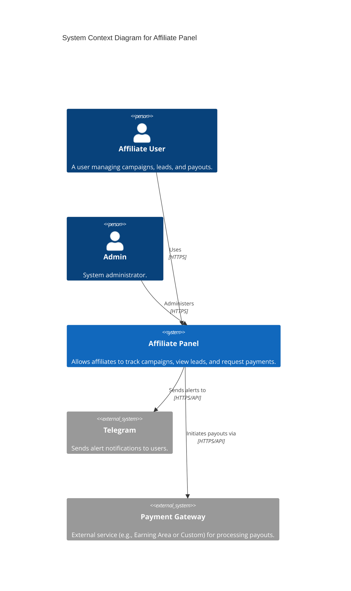
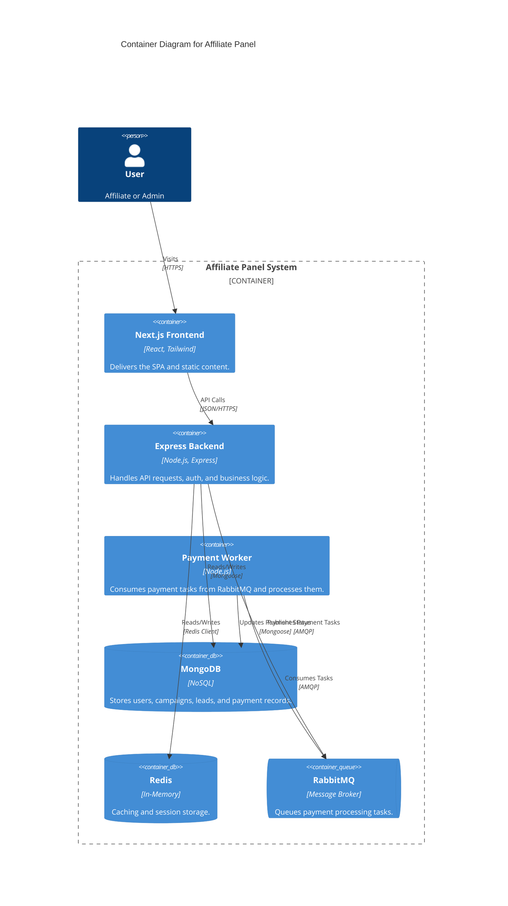

# System Architecture

## 1. System Context (C4 Context)



## 2. Container Architecture



## 3. Payment Processing Flow (Sequence Diagram)

```mermaid
sequenceDiagram
    participant User
    participant Frontend
    participant API as Express API
    participant DB as MongoDB
    participant RMQ as RabbitMQ
    participant Worker as Payment Worker
    participant Gateway as External Gateway

    User->>Frontend: Request Payout
    Frontend->>API: POST /api/payments/payToUser
    API->>DB: Validate User & Balance
    alt Validation Fails
        API-->>Frontend: Error (Insufficient Funds/Ban)
    else Validation Success
        API->>DB: Create "Pending" Payment Record
        API->>RMQ: Publish Payment Task
        API-->>Frontend: Success (Request Queued)
    end
    
    RMQ->>Worker: Consume Task
    Worker->>Gateway: Initiate Payout
    Gateway-->>Worker: Response (Success/Fail)
    Worker->>DB: Update Payment & Lead Status
    
    opt Notification Enabled
        Worker->>User: Send Telegram Alert
    end

## 4. Data Model Relationships

```mermaid
erDiagram
    USER ||--o{ CAMPAIGN : owns
    USER ||--o{ CLICK : "tracks for"
    USER ||--o{ LEAD : manages
    USER ||--o{ PAYMENT : "payouts to"
    USER ||--o{ GATEWAY_SETTING : configures
    USER ||--o{ BAN : "blocks numbers"
    
    CAMPAIGN ||--o{ CLICK : "has many"
    CAMPAIGN ||--o{ LEAD : "generates"
    CAMPAIGN ||--o{ PENDING_PAYMENT : "queues for"
    
    CLICK ||--o| LEAD : "converts to"
    CLICK ||--o{ PAYMENT : "linked to"
    
    LEAD ||--o| PAYMENT : "triggers"
    PENDING_PAYMENT ||--o| PAYMENT : "becomes"
```
```
